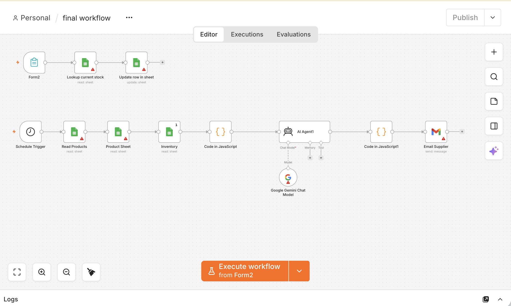

# Inventory Replenishment & Procurement Automation

A team-based inventory and supplier communication automation project built during an n8n Hackathon using **n8n, Google Sheets, JavaScript, Google Gemini, and Gmail**.

The project explores how workflow automation can connect inventory data, business logic, AI-assisted processing, and supplier communication in a single system.

---

## Project Overview

Manual inventory management often requires employees to repeatedly check stock levels, update spreadsheets, identify products that require replenishment, and communicate with suppliers.

Our team designed and built an n8n workflow that automates several parts of this process.

The final workflow contains two main automation paths:

1. **Inventory Update Flow**
   - Accepts inventory information through a form
   - Looks up the current stock level
   - Updates inventory data in Google Sheets

2. **Automated Inventory & Supplier Flow**
   - Runs automatically using a scheduled trigger
   - Reads product and inventory data from Google Sheets
   - Processes inventory information using JavaScript
   - Sends data through an AI Agent connected to Google Gemini
   - Processes the supplier communication
   - Sends an email to the supplier through Gmail

---

## Workflow

### Workflow Overview



### Final Workflow Structure

#### Inventory Update Flow

```text
Form Submission
      ↓
Lookup Current Stock
      ↓
Update Inventory in Google Sheets
```

#### Automated Inventory & Supplier Flow

```text
Schedule Trigger
      ↓
Read Product Data
      ↓
Read Inventory Data
      ↓
Process Inventory Logic with JavaScript
      ↓
AI Agent
      ↓
Google Gemini Chat Model
      ↓
Process Supplier Communication
      ↓
Email Supplier
```

The workflow combines structured inventory data, workflow logic, AI-assisted processing, and automated communication through n8n.

---

## Key Components

### 1. Form-Based Inventory Updates

The first part of the workflow allows inventory information to be submitted through a form.

The workflow then:

- Looks up the current stock level
- Identifies the relevant inventory record
- Updates the corresponding row in Google Sheets

This creates a simple method for keeping inventory data updated.

### 2. Scheduled Automation

A Schedule Trigger starts the second workflow automatically.

This allows inventory and supplier-related processes to run without requiring a user to manually start the workflow each time.

### 3. Google Sheets Integration

Google Sheets is used as a structured data source for product and inventory information.

The workflow reads information from the sheets and uses it as input for later automation steps.

### 4. JavaScript Processing

JavaScript nodes are used to process workflow data and apply logic before passing information to later nodes.

This demonstrates how custom code can be combined with no-code and low-code automation tools.

### 5. AI Agent with Google Gemini

An AI Agent is connected to the Google Gemini Chat Model.

The AI component is integrated into the workflow between inventory processing and supplier communication.

This demonstrates how an AI model can be incorporated into a broader business automation process rather than used as a standalone chatbot.

### 6. Supplier Email Automation

After the workflow processes the required information, Gmail is used to send an email to the supplier.

This connects inventory monitoring directly with supplier communication.

---

## My Contribution

My contribution to the team project included:

- Developing the cosmetics inventory use case
- Mapping six raw materials to their corresponding suppliers
- Contributing to the design of the inventory and procurement workflow
- Working with the team to connect inventory information with supplier communication
- Supporting the development and testing of the n8n workflow
- Helping prepare the final workflow demonstration and presentation

---

## Technologies Used

- **n8n** — workflow automation
- **Google Sheets** — inventory and product data
- **JavaScript** — workflow data processing and logic
- **Google Gemini** — AI model connected to the n8n AI Agent
- **Gmail** — automated supplier communication
- **GitHub** — project documentation and portfolio presentation

---

## What I Learned

Through this hackathon, I gained hands-on experience with:

- Designing multi-step automation workflows
- Connecting multiple services within n8n
- Working with structured inventory and supplier data
- Combining JavaScript with low-code automation
- Integrating an AI model into a business workflow
- Automating email communication
- Translating a business process into technical workflow logic
- Collaborating with a team under hackathon time constraints
- Presenting a technical workflow in a short demonstration

---

## Business Use Case

The project demonstrates how workflow automation can reduce repetitive manual work in inventory management.

Instead of manually checking spreadsheets, processing inventory information, and preparing supplier communications separately, the workflow connects these steps into one automated process.

Potential use cases include:

- Retail inventory management
- Cosmetics and raw-material procurement
- Hospitality supplies
- Small-business inventory monitoring
- Supplier communication automation

---

## Future Improvements

Possible future improvements include:

- Adding formal reorder-point calculations
- Adding safety-stock and lead-time parameters
- Creating purchase orders automatically
- Adding human approval for higher-value purchases
- Adding supplier performance tracking
- Building a real-time inventory dashboard
- Adding demand forecasting
- Supporting multiple companies or inventory categories
- Matching invoices and delivery documents automatically
- Adding more detailed error handling and workflow monitoring

---

## Project Context

This project was developed collaboratively during an **n8n Hackathon**.

The repository documents the final workflow, my contribution to the team project, and the technical concepts I learned while building the solution.
